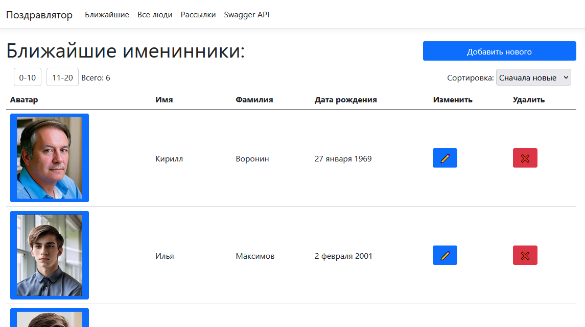
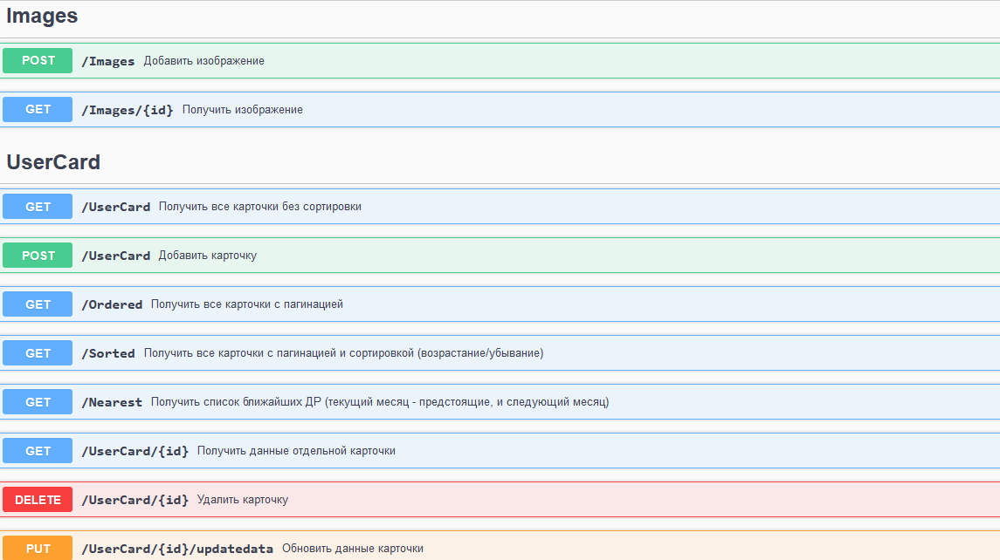

# Test .NET MVC application for SolarLab 2024

## API example (Swagger):

## API: ASP.NET Core MVC
## Front-end: Razor pages
## Database: SQLite (local file)
## Image service storage: local (wwwroot/uploads)
## Tests: MSTest